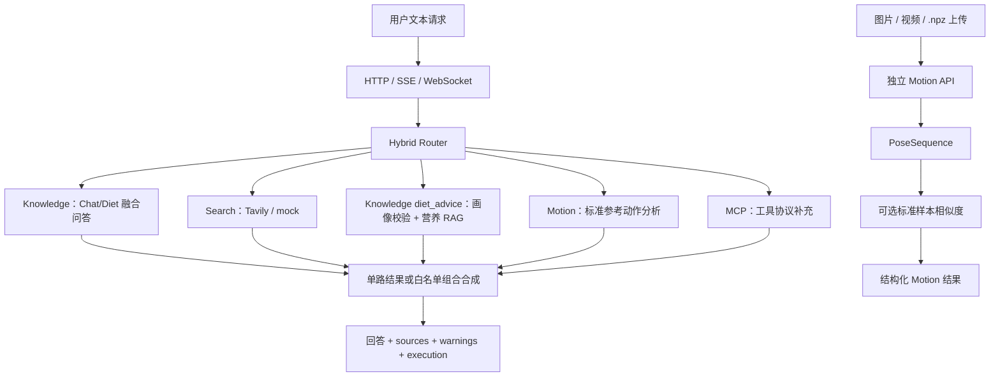

# 个人健身助手智能体

一个面向 Agent 岗位面试展示的多任务 LLM Agent 项目，以健身、营养与动作分析作为业务场景。项目重点不是追求健身产品的功能数量，而是用 LangGraph 把路由、RAG、实时搜索、数值算法、记忆和外部工具组织成可解释、可评测、可降级的执行系统，并为每项设计准备可演示、可追问的工程证据。

如果没有编程基础，请从 [零基础项目地图](docs/interview/01_零基础项目地图.md) 开始，不需要先阅读源码或接口文档。

## 项目亮点

- Hybrid Router：加权规则、语义样例、歧义检测和四种白名单多意图组合；本地 Qwen Router 完成 A/B 后因无准确率收益且延迟较高而默认关闭。
- Knowledge：产品层将 Chat/Diet 统一为 Knowledge 能力域；代码层保留两个兼容执行分支，并共用 RAG、来源约束和上下文组装。
- RAG：Sentence-Transformers + Milvus/内存 Retriever，按标题层级、段落和句子做结构感知分块，并支持真实相邻块重叠、章节元数据、稳定主键、同源幂等替换、来源透传和失败降级；当前收录 12 份可索引知识文档，来源覆盖 WHO、CDC、ACSM、中国居民膳食指南、ISSN、NIDDK、NATA 和 AASM，并建立 21 条检索/RAGAS 黄金集及可分阶段、可断点续跑的评测入口。
- Motion：标准参考动作分析原型，支持图片/视频转 PoseSequence、同 schema 标准视频构建、髋中心归一化、FastDTW、余弦和 DTW 对齐后的逐关节平均距离，并输出可解释的结构化反馈。
- Search：Query Understanding、Tavily/mock Search、Answer Synthesis 与来源 URL 透传。
- Knowledge-Diet：作为 Knowledge 内部 `diet_advice` 链路，LLM 提取结果经过 Pydantic JSON 解析、范围与枚举校验，再进入营养检索和推荐；非法输出安全降级并公开 warning。
- MCP：定位为工具协议补充，自实现轻量 subprocess + stdio JSON-RPC Client 原型，默认 mock；工具执行点已接入 `ToolRegistry` 的 `mcp.call_tool`，并公开真实/mock/fallback 执行轨迹。
- 工程链路：FastAPI、HTTP/SSE/WebSocket、同步 LangGraph/LLM 到 asyncio 的线程桥接、Web UI、微信小程序、统一 ToolResult/ErrorCode 与专项验收记录。

## 当前架构



重要口径：媒体上传通过独立 Motion API 执行，已经打通姿态提取、标准参考比较和结构化反馈链路；对话 Router 仍负责文本类 Motion 规划。MCP 是外部工具协议补充，不作为饮食主链路本身。

## 快速启动

推荐 Python 3.11：

```powershell
conda activate fitness-agent
pip install -r requirements.txt
$env:LLM_MOCK="true"
$env:RETRIEVER_BACKEND="memory"
$env:MCP_SERVER_COMMAND="mock"
python -m uvicorn app.main:app --host 127.0.0.1 --port 8000
```

启动后：

- Web UI：`http://127.0.0.1:8000/ui`
- 健康存活检查：`http://127.0.0.1:8000/health`
- OpenAPI：`http://127.0.0.1:8000/docs`

真实图片/视频姿态分析需要额外安装：

```powershell
pip install -r requirements-motion.txt
```

并准备 `data/models/pose_landmarker.task`。完整模型下载、标准动作构建和联调命令见 [运行手册](docs/运行与排错.md)。

## 验证状态

当前自动化回归：

```text
247 passed, 2 skipped, 1 warning
```

默认 pytest 会 mock 本地 LLM 与部分 embedding，因此该数字主要证明代码、接口、算法和降级契约可回归。当前 warning 来自 Starlette TestClient/httpx 兼容层弃用提示，不影响测试结论。项目另有真实 Milvus 链路验证、RAG 检索评测、MediaPipe 图片/视频冒烟和 Qwen Router A/B 记录。

## 当前边界

- 当前服务定位为本地面试原型：没有登录鉴权、请求限流、会话 TTL 或多实例共享；会话与长期记忆已写入本地 SQLite，但仍不应直接暴露到公网。
- `/health` 只是进程存活检查，不代表 Qwen、Milvus、MediaPipe、Tavily 或 MCP 已就绪。
- 会话缓冲区最多保存 6 轮，当前由 Knowledge 问答链路优先消费；跨 Search/Motion/MCP 的长期画像联动仍可继续增强。
- MCP 默认使用 mock，是工具协议补充；真实 Server 的响应 ID、inputSchema、通知语义和兼容性治理可继续补强。
- Motion 已完成媒体输入、标准参考构建、相似度比较、关节级定位和质量门控；正式标准样本集、动作周期切分、关键点平滑及专业专项评分仍需继续补齐。
- Milvus 已完成真实写入/检索链路验证；21 条 RAG 黄金集已补齐参考答案，单一 RAGAS 入口会让 19 条可回答样例走真实检索与生成链路，并评估上下文相关性、忠实度和答案相关性；2 条无答案样例暂不混入这三项均分。2026-07-22 使用本地 `bge-small-zh-v1.5`、Top-5、阈值 0.5 对 81 个分块做检索冒烟，19 条可回答样例的正确来源和人工证据片段均命中 19/19；这不是三项 RAGAS 最终分数。
- 微信小程序代码链路已接通，开发者工具、真机、HTTPS 和弱网验收待完成。
- 当前 Dockerfile 不包含 Motion 可选依赖和 MediaPipe task 模型，完整跨机器构建尚未验证。

## 文档入口

| 需求 | 文档 |
|---|---|
| 项目当前事实、能力与边界 | [docs/项目总览.md](docs/项目总览.md) |
| HTTP、SSE、WebSocket 与 Motion API | [docs/接口说明.md](docs/接口说明.md) |
| 安装、配置、测试、Docker 与联调 | [docs/运行与排错.md](docs/运行与排错.md) |
| 面试主线与技术问答 | [docs/interview/README.md](docs/interview/README.md) |
| Router / Motion 技术设计 | [docs/technical/README.md](docs/technical/README.md) |
| 测试与真实链路证据 | [docs/项目证据.md](docs/项目证据.md) |
| 文档学习入口 | [docs/README.md](docs/README.md) |

## 技术栈

Python · FastAPI · LangGraph · Qwen3 · Sentence-Transformers · Milvus · Tavily · MediaPipe · OpenCV · NumPy · FastDTW · MCP/JSON-RPC · 微信小程序
