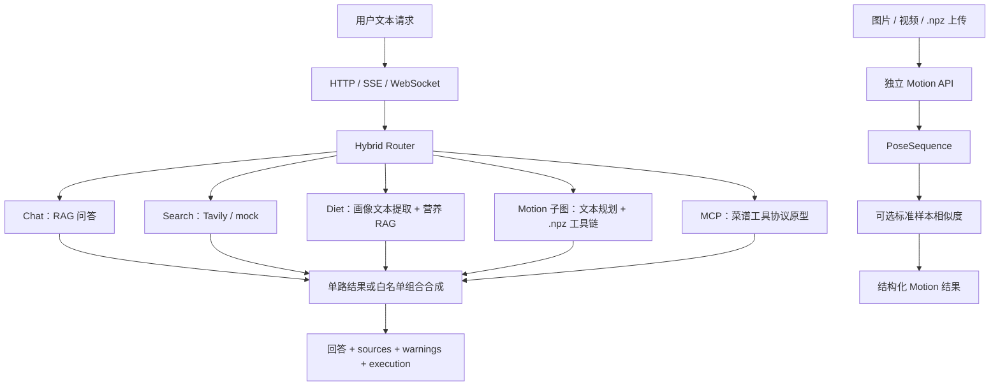

# Personal Fitness Assistant Agent

一个面向健身、营养与动作分析场景的多任务 LLM Agent 原型。项目重点不是把能力堆进一个 Prompt，而是用 LangGraph 把路由、RAG、实时搜索、数值算法和外部工具组织成可解释、可评测、可降级的执行系统。

## 项目亮点

- Hybrid Router：加权规则、语义样例、歧义检测和四种白名单多意图组合；本地 Qwen Router 完成 A/B 后因无准确率收益且延迟较高而默认关闭。
- RAG：Sentence-Transformers + Milvus/内存 Retriever，支持稳定主键、幂等 upsert、编号证据块、来源标识透传和失败降级。
- Motion：图片/视频转 PoseSequence，同 schema 标准视频构建，髋中心归一化、FastDTW、余弦和 DTW 对齐后的逐关节平均距离。
- Search：Query Understanding、Tavily/mock Search、Answer Synthesis 与来源 URL 透传。
- MCP：自实现轻量 subprocess + stdio JSON-RPC Client 原型，默认 mock，并公开真实/mock/fallback 执行轨迹。
- 工程链路：FastAPI、HTTP/SSE/WebSocket、Web UI、微信小程序、统一 ToolResult/ErrorCode 与专项验收记录。

## 当前架构



重要边界：媒体上传目前通过独立 Motion API 执行，尚未作为附件进入 `/chat` Router；相似度表示与参考样本的统计接近程度，不等于专业动作质量诊断。

## 快速启动

推荐 Python 3.11：

```powershell
conda activate fitness-agent
pip install -r requirements.txt
$env:LLM_MOCK="true"
$env:RETRIEVER_BACKEND="memory"
$env:MCP_SERVER_COMMAND="mock"
python -m uvicorn app.main:app --host 127.0.0.1 --port 8000
```

启动后：

- Web UI：`http://127.0.0.1:8000/ui`
- 健康存活检查：`http://127.0.0.1:8000/health`
- OpenAPI：`http://127.0.0.1:8000/docs`

真实图片/视频姿态分析需要额外安装：

```powershell
pip install -r requirements-motion.txt
```

并准备 `data/models/pose_landmarker.task`。完整模型下载、标准动作构建和联调命令见 [运行手册](docs/RUNBOOK.md)。

## 验证状态

当前自动化回归：

```text
150 passed, 2 skipped, 1 warning
```

默认 pytest 会 mock 本地 LLM 与 SentenceTransformer，因此该数字证明代码、接口、算法和降级契约可回归，不代表真实模型回答质量或 Milvus 检索质量。项目另外保留了真实 MediaPipe 图片/视频冒烟、Qwen Router A/B 和可选 Milvus 集成测试记录。

## 当前边界

- 当前服务定位为本地面试原型：没有登录鉴权、请求限流和持久化会话，CORS 允许任意来源，不应直接暴露到公网。
- `/health` 只是进程存活检查，不代表 Qwen、Milvus、MediaPipe、Tavily 或 MCP 已就绪。
- 会话缓冲区最多保存 6 轮，但当前只有 Chat 消费最后 6 条消息；跨子图记忆尚未完成。
- MCP 默认使用 mock；真实 Server 的响应 ID、inputSchema、通知语义和兼容性验收待补。
- Motion 缺关键点平滑、动作周期切分、正式标准样本集和关节级专项纠错。
- Milvus 代码与容器配置已具备，Recall@K、MRR 和 P95 延迟基线待建立。
- 微信小程序代码链路已接通，开发者工具、真机、HTTPS 和弱网验收待完成。
- 当前 Dockerfile 不包含 Motion 可选依赖和 MediaPipe task 模型，完整跨机器构建尚未验证。

## 文档入口

| 需求 | 文档 |
|---|---|
| 项目当前事实、能力与边界 | [docs/README.md](docs/README.md) |
| HTTP、SSE、WebSocket 与 Motion API | [docs/API.md](docs/API.md) |
| 安装、配置、测试、Docker 与联调 | [docs/RUNBOOK.md](docs/RUNBOOK.md) |
| 面试主线与技术问答 | [docs/interview/README.md](docs/interview/README.md) |
| Router / Motion 技术设计 | [docs/technical/README.md](docs/technical/README.md) |
| 测试与真实链路证据 | [docs/tests/README.md](docs/tests/README.md) |
| 完整文档导航 | [docs/DOCUMENTATION_MAP.md](docs/DOCUMENTATION_MAP.md) |

## 技术栈

Python · FastAPI · LangGraph · Qwen3 · Sentence-Transformers · Milvus · Tavily · MediaPipe · OpenCV · NumPy · FastDTW · MCP/JSON-RPC · 微信小程序
