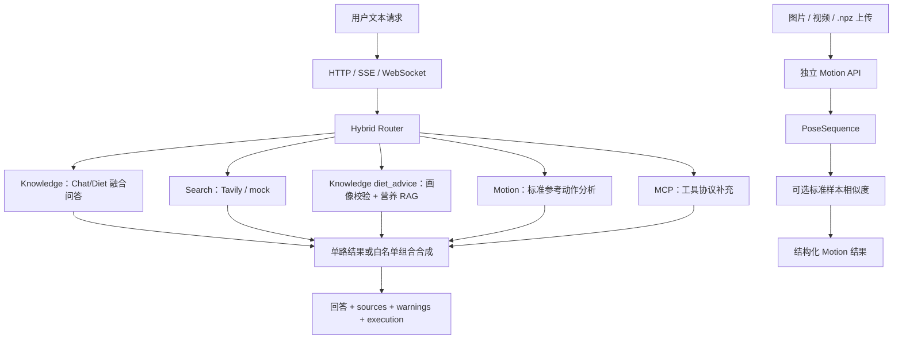

# 个人健身助手智能体

一个面向 Agent 岗位面试展示的多任务 LLM Agent 项目，以健身、营养与动作分析作为业务场景。项目重点不是追求健身产品的功能数量，而是用 LangGraph 把路由、RAG、实时搜索、数值算法、记忆和外部工具组织成可解释、可评测、可降级的执行系统，并为每项设计准备可演示、可追问的工程证据。

**项目示意图如下：**


## 项目亮点

- Hybrid Router：加权规则、语义样例、歧义检测和四种白名单多意图组合；本地 Qwen Router 完成 A/B 后因无准确率收益且延迟较高而默认关闭。
- Knowledge：产品层将 Chat/Diet 统一为 Knowledge 能力域；代码层保留两个兼容执行分支，并共用 RAG、来源约束和上下文组装。
- RAG：默认由 `BAAI/bge-small-zh-v1.5` 完成 Dense 向量检索，与 BM25 各召回 20 条；融合前不做固定相似度硬过滤，经 RRF 融合去重后向本地 `Qwen3-0.6B` 注入 Top-5 证据。生成端采用 `grounded-v3` 证据约束和确定性解码，要求保留否定关系、适用人群与剂量阶段，并用 `[RefN]` 标注依据。SQLite 持久化文本、向量与来源元数据，FAISS 在进程内重建余弦索引，并保留结构感知分块、章节透传、同源幂等替换和内存降级。当前收录 12 份可索引知识文档，并建立 80 条分层检索/RAGAS 黄金集（60 条可回答、20 条无答案）、Dense/Hybrid 对比入口及可断点续跑的三指标评测入口。
- Motion：标准参考动作分析原型，支持图片/视频转 PoseSequence、同 schema 标准视频构建、髋中心归一化、FastDTW、余弦和 DTW 对齐后的逐关节平均距离，并输出可解释的结构化反馈。
- Search：Query Understanding、Tavily/mock Search、Answer Synthesis 与来源 URL 透传。
- Knowledge-Diet：作为 Knowledge 内部 `diet_advice` 链路，LLM 提取结果经过 Pydantic JSON 解析、范围与枚举校验，再进入营养检索和推荐；非法输出安全降级并公开 warning。
- MCP：定位为工具协议补充，自实现轻量 subprocess + stdio JSON-RPC Client 原型，默认 mock；工具执行点已接入 `ToolRegistry` 的 `mcp.call_tool`，并公开真实/mock/fallback 执行轨迹。
- 工程链路：FastAPI、HTTP/SSE/WebSocket、同步 LangGraph/LLM 到 asyncio 的线程桥接、Web UI、微信小程序、统一 ToolResult/ErrorCode 与专项验收记录。

## 当前架构


```mermaid
flowchart TD
    U["用户文本请求"] --> API["HTTP / SSE / WebSocket"]
    API --> R["Hybrid Router"]
    R --> C["Knowledge：Chat/Diet 融合问答"]
    R --> S["Search：Tavily / mock"]
    R --> D["Knowledge diet_advice：画像校验 + 营养 RAG"]
    R --> M["Motion：标准参考动作分析"]
    R --> P["MCP：工具协议补充"]
    C --> SYN["单路结果或白名单组合合成"]
    S --> SYN
    D --> SYN
    M --> SYN
    P --> SYN
    SYN --> OUT["回答 + sources + warnings + execution"]

    MEDIA["图片 / 视频 / .npz 上传"] --> MA["独立 Motion API"]
    MA --> PS["PoseSequence"]
    PS --> SIM["可选标准样本相似度"]
    SIM --> MO["结构化 Motion 结果"]
```

重要口径：媒体上传通过独立 Motion API 执行，已经打通姿态提取、标准参考比较和结构化反馈链路；对话 Router 仍负责文本类 Motion 规划。MCP 是外部工具协议补充，不作为饮食主链路本身。

## 快速启动

推荐 Python 3.11：

```powershell
conda activate fitness-agent
pip install -r requirements.txt

python -m uvicorn app.main:app --host 127.0.0.1 --port 8000
```

启动后：

- Web UI：`http://127.0.0.1:8000/ui`
- 健康存活检查：`http://127.0.0.1:8000/health`
- OpenAPI：`http://127.0.0.1:8000/docs`

真实图片/视频姿态分析需要额外安装：

```powershell
pip install -r requirements-motion.txt
```

并准备 `data/models/pose_landmarker.task`。完整模型下载、标准动作构建和联调命令见 [运行手册](docs/project/运行与排错.md)。

## 验证状态

当前自动化回归：

```text
266 passed, 1 skipped, 3 warnings
```

默认 pytest 会 mock 本地 LLM 与部分 embedding，因此该数字主要证明代码、接口、算法和降级契约可回归。当前 warning 来自 Starlette TestClient/httpx、LangGraph 迁移提示和 jieba 间接依赖的弃用提示，不影响测试结论。项目另有 SQLite + FAISS 持久化冒烟、RAG 检索评测、MediaPipe 图片/视频冒烟和 Qwen Router A/B 记录。

## 技术栈

Python · FastAPI · LangGraph · Qwen3 · Sentence-Transformers · SQLite · FAISS · BM25/RRF · Tavily · MediaPipe · OpenCV · NumPy · FastDTW · MCP/JSON-RPC · 微信小程序
